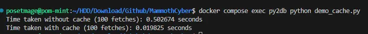

# MCyber_TH

## Explanation

The core design of our cache implementation is located in [`cache.py`](/python/src/cache.py). 

I use the Least Recently Used (LRU) algorithm as the cache eviction policy. To meet the requirement:

```
5. Only consecutive cache hits (2 or more times) are counted as "being used."
```

I use two local variables:

1. **`lru_cache`**: This stores the actual cached data following the LRU policy.
2. **`temp_buffer`**: This temporarily holds keys that are encountered for the first time. 

- When a key is accessed for the first time, it is added to `temp_buffer` means an initial counter value of 1.
- If the key is accessed again (i.e., it's a "being used"), the key is removed from `temp_buffer` and inserted into the head of `lru_cache` with its associated value.

This mechanism ensures that only keys with consecutive hits are promoted to the main cache.

and this work is using ChatGPT to support coding and code review, this is the [chat history](./ChatGPT.html)

## Run the scripts:

I use PostgreSQL to make disk fetching for measure speed

* env build
    ```
    docker compose build
    docker compose up -d
    docker compose exec py2db python library_create.py
    docker compose exec py2db python library_add.py
    ```
* running cache demo
    ```
    docker compose exec py2db python demo_cache.py
    ```

compare run 100 time of without cache vs with cahce:  

